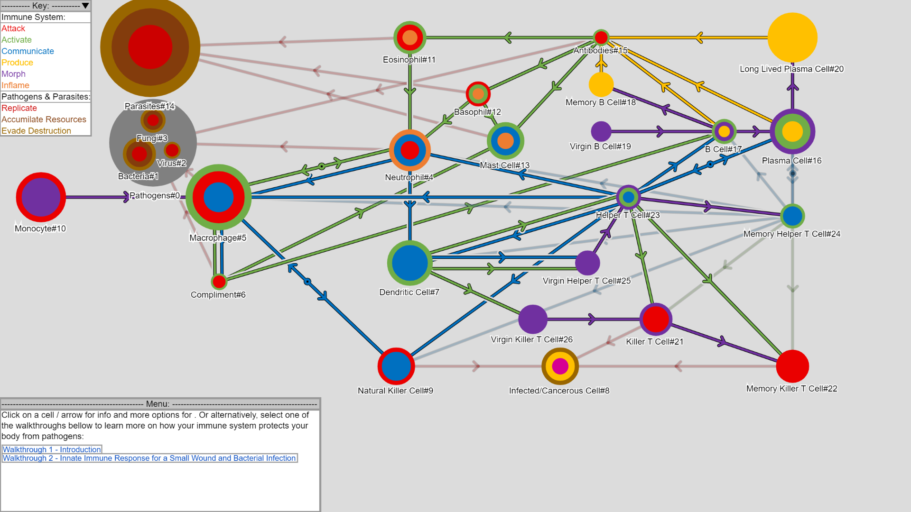

## Description ##

A personal school project to model the behaviour of the human immune system as a network graph with interactive visualisation.  

Written in JavaScript using the [p5.js](https://p5js.org) library.

For the first-release MVP, nodes and links are coded into `sketch.js`. A user can step through stages of the immune response to an attack using a menu and see the different interactions between critical components of each stage of the immune response.

## Installation ##

**Either** use `git` (if you have git installed):  
- Clone this repo to your local environment  
- The HTML and JavaScript code is in the `html` folder.   

**Or** download the packaged zip archive from this GitHub website:  
- Click on the `html.zip` file and use the GitHub *Download* button to download the zip archive  
- extract the zip archive in a folder where you want to run the utility from
- The extract includes an `html` folder with the HTML and JavaScript code.

## Usage ##

The tool can be started by loading the
`./html/index.html`
file in a browser.  Usually this can be done by just double-clicking on the file in a Windows or Mac file browser.

Cells, proteins and pathogens are represented as "nodes" in a graph topology. 

Click on a Node to rearrange its position or to view information about it.

Select a walk-through from the bottom-left menu box.  
Use the navigator arrows in the bottom-left menu box to step through the stages of an immune response.

The key in the top-left corner can be used to identify the core functions of each component of the immune system as 
well as the types of interactions between the different nodes.

## Screenshot ##

## Contributing ##

As this is a school project, I am not accepting contributions at this stage.  You are welcome to fork the project under the terms of GNU GPL license for this project.
